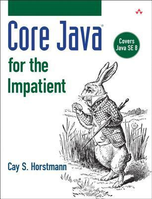

In this post we take a look at the major changes to the Java language since
the release of Java 8. Just to recap, Java 1 was released in 1996, and Java 8 in
2014, in 2017 Java moved to a new release train where we basically see a new
version every six months, the latest release being version 23 (2024).

Soon after Java version 8 was released I bought a decent book on the subject and
I took some time to study it thoroughly, a great book by the way: "Core Java for
the impatient" by [Cay S. Horstmann](https://horstmann.com/), highly
recommended. I did notice on his website that he had an updated version
available so try and find that one if you are going to buy the book.


{class="text-center"}

Java 8 was of course a major release and milestone for Java, it had so many
improvements and major changes, most important (IMO) being lambda functions,
that changed it from a procedural language to a hybrid that allows both
procedural and functional style code to coexist in a fantastic manner.

Ever since Java 8 was released I have been keeping an eye on releases and what
new features they bring. Most of the time the features are focused on improving
the JVM, but now and then there are also some nice Java language enhancements
and some new exciting APIs. The complete list of feature enhancements and
changes can be found here:
[Java version history](https://en.wikipedia.org/wiki/Java_version_history)

I have summarized the major changes that have affected
the Java language (not that the JVM improvements are not imported) below since
version 8, I also mention some notable APIs and other interesting developments.

| Version | Specification | Name                                                | Notes                                                                           |
| ------- | ------------- | --------------------------------------------------- | ------------------------------------------------------------------------------- |
| Java 8  | JEP 126       | Lambda Expressions & Virtual Extension Methods      |                                                                                 |
|         | JEP 104       | Type Annotations                                    |                                                                                 |
|         | JEP 120       | Repeating Annotations                               |                                                                                 |
|         | JEP 150       | Date & Time API                                     |                                                                                 |
| Java 9  | JEP 193       | Variable Handles                                    | [Variable Handles]()                               |
|         | JEP 295       | Ahead-of-Time Compilation                           | Notable optimization, provided by GraalVM.                                      |
| Java 10 | JEP 286       | Local-Variable Type Inference                       | `var hello = "world";`                                                          |
| Java 11 | JEP 323       | Local-Variable Syntax for Lambda Parameters         | `(x, y) -> x.process(y)`                                                        |
| Java 12 | JEP 325       | Switch Expressions                                  | [Switch Expressions]()                           |
| Java 13 | JEP 355       | Text Blocks                                         | [Text Blocks]()                                         |
| Java 14 | JEP 305       | Pattern Matching for instanceof                     | [Pattern Matching for instanceof]() |
|         | JEP 359       | Records                                             | [Records]()                                                 |
| Java 15 | JEP 360       | Sealed Classes                                      | [Sealed Classes]()                                   |
| Java 16 | JEP 338       | Vector API                                          | Useful GPU abstraction.                                                         |
|         | JEP 369       | Migrate to GitHub                                   | [OpenJDK](https://github.com/openjdk)                                           |
| Java 17 | JEP 406       | Pattern Matching for switch                         | [Pattern Matching for switch]()         |
| Java 18 | JEP 413       | Code Snippets in Java API Documentation             |                                                                                 |
| Java 19 | JEP 405       | Record Patterns                                     | [Record Patterns]()                                 |
|         | JEP 425       | Virtual Threads                                     | [Virtual Threads]()                                 |
|         | JEP 428       | Structured Concurrency                              | [Structured Concurrency]()                   |
| Java 20 | JEP 429       | Scoped Values                                       | [Scoped Values]()                                     |
| Java 21 | JEP 430       | String Templates                                    | [String Templates]()                               |
|         | JEP 431       | Sequenced Collections                               | [Sequenced Collections]()                                                                          |
|         | JEP 443       | Unnamed Patterns and Variables                      |                                                                                 |
|         | JEP 445       | Unnamed Classes and Instance Main Methods           |                                                                                 |
| Java 22 | JEP 447       | Statements before super(...)                        |                                                                                 |
|         | JEP 461       | Stream Gatherers                                    |                                                                                 |
| Java 23 | JEP 455       | Primitive Types in Patterns, instanceof, and switch |                                                                                 |
|         | JEP 467       | Markdown Documentation Comments                     |                                                                                 |
{class="table table-sm table-bordered"}

## Variable Handles {#variable-handles}

Details videos and articles on the subject:

- [Java 9 VarHandles Best practices, and why? by Tobi Ajila](https://www.youtube.com/watch?v=w2zaqhFczjY) |
- [Java Variable Handles Demystified](https://www.baeldung.com/java-variable-handles)

## Switch Expressions {#switch-expressions}

Example:

```java
public class SwitchExpressionExample {
    public static void main(String[] args) {
        String day = "MONDAY";
        int dayNumber = switch (day) {
            case "MONDAY" -> 1;
            case "TUESDAY" -> 2;
            case "WEDNESDAY" -> 3;
            case "THURSDAY" -> 4;
            case "FRIDAY" -> 5;
            case "SATURDAY" -> 6;
            case "SUNDAY" -> 7;
            default -> throw new IllegalArgumentException("Invalid day: " + day);
        };

        System.out.println("The day number for " + day + " is " + dayNumber);
    }
}
```

## Text Blocks {#text-blocks}

Example:

```java
public class TextBlockExample {
    public static void main(String[] args) {
        String json = """
                {
                    "name": "John Doe",
                    "age": 30,
                    "address": {
                        "street": "123 Main St",
                        "city": "Anytown",
                        "state": "CA"
                    }
                }
                """;

        System.out.println(json);
    }
}
```

## Pattern Matching for instanceof {#pattern-matching-of-instanceof}

Example:

```java
public class PatternMatchingInstanceofExample {
    public static void main(String[] args) {
        Object obj = "Hello, World!";

        if (obj instanceof String s) {
            System.out.println("The string is: " + s);
            System.out.println("String length: " + s.length());
        } else {
            System.out.println("The object is not a string.");
        }
    }
}
```

## Records

Example:

```java
public record Person(String name, int age) {
    // You can add methods, static fields, and static methods if needed
    public String greet() {
        return "Hello, my name is " + name + " and I am " + age + " years old.";
    }
}

public class RecordExample {
    public static void main(String[] args) {
        Person person = new Person("John Doe", 30);
        System.out.println(person.name()); // Accessor method for name
        System.out.println(person.age());  // Accessor method for age
        System.out.println(person.greet()); // Custom method
    }
}
```

## Sealed Classes

Example:

```java
public abstract sealed class Shape permits Circle, Rectangle, Square {
    public abstract double area();
}

public final class Circle extends Shape {
    private final double radius;

    public Circle(double radius) {
        this.radius = radius;
    }

    @Override
    public double area() {
        return Math.PI * radius * radius;
    }
}

public final class Rectangle extends Shape {
    private final double width;
    private final double height;

    public Rectangle(double width, double height) {
        this.width = width;
        this.height = height;
    }

    @Override
    public double area() {
        return width * height;
    }
}

public final class Square extends Shape {
    private final double side;

    public Square(double side) {
        this.side = side;
    }

    @Override
    public double area() {
        return side * side;
    }
}

public class SealedClassExample {
    public static void main(String[] args) {
        Shape circle = new Circle(5);
        Shape rectangle = new Rectangle(4, 6);
        Shape square = new Square(3);

        System.out.println("Circle area: " + circle.area());
        System.out.println("Rectangle area: " + rectangle.area());
        System.out.println("Square area: " + square.area());
    }
}
```

## Pattern Matching for switch

Example:

```java
public class PatternMatchingSwitchExample {
    public static void main(String[] args) {
        Object obj = "Hello, World!";

        String result = switch (obj) {
            case Integer i -> "Integer with value " + i;
            case Long l -> "Long with value " + l;
            case Double d -> "Double with value " + d;
            case String s -> "String with value " + s;
            default -> "Unknown type";
        };

        System.out.println(result);
    }
}
```

## Record Patterns

Example:

```java
public record Point(int x, int y) {}

public class RecordPatternExample {
    public static void main(String[] args) {
        Object obj = new Point(3, 4);

        String result = switch (obj) {
            case Point(int x, int y) -> "Point with coordinates (" + x + ", " + y + ")";
            default -> "Unknown type";
        };

        System.out.println(result);
    }
}
```

## Virtual Threads

Example:

```java
public class VirtualThreadsExample {
    public static void main(String[] args) throws InterruptedException {
        Runnable task = () -> {
            try {
                Thread.sleep(1000);
                System.out.println("Hello from " + Thread.currentThread());
            } catch (InterruptedException e) {
                Thread.currentThread().interrupt();
            }
        };

        Thread virtualThread = Thread.ofVirtual().start(task);

        // Wait for the virtual thread to complete
        virtualThread.join();
    }
}
```

## Structured Concurrency

Example:

```java
import java.util.concurrent.ExecutionException;
import java.util.concurrent.Executors;
import java.util.concurrent.Future;
import java.util.concurrent.StructuredTaskScope;

public class StructuredConcurrencyExample {
    public static void main(String[] args) {
        try (var scope = new StructuredTaskScope.ShutdownOnFailure()) {
            Future<String> task1 = scope.fork(() -> {
                Thread.sleep(1000);
                return "Result from task1";
            });

            Future<String> task2 = scope.fork(() -> {
                Thread.sleep(2000);
                return "Result from task2";
            });

            scope.join();           // Wait for all tasks to complete
            scope.throwIfFailed();  // Propagate any exceptions

            // Retrieve results
            String result1 = task1.resultNow();
            String result2 = task2.resultNow();

            System.out.println(result1);
            System.out.println(result2);
        } catch (InterruptedException | ExecutionException e) {
            e.printStackTrace();
        }
    }
}
```

## Scoped Values

Example:

```java
import java.util.concurrent.Executors;
import java.util.concurrent.ExecutorService;
import java.util.concurrent.Callable;
import java.util.concurrent.ExecutionException;

public class ScopedValuesExample {
    // Define a scoped value
    private static final ScopedValue<String> USERNAME = ScopedValue.newInstance();

    public static void main(String[] args) throws InterruptedException, ExecutionException {
        ExecutorService executor = Executors.newFixedThreadPool(2);

        // Set the scoped value for the main thread
        ScopedValue.where(USERNAME, "mainUser").run(() -> {
            Callable<String> task = () -> {
                // Access the scoped value in a different thread
                return "Hello from " + USERNAME.get();
            };

            var future = executor.submit(task);
            System.out.println(future.get());
        });

        executor.shutdown();
    }
}
```

## String Templates

Example:

```java
public class StringTemplatesExample {
    public static void main(String[] args) {
        String name = "John";
        int age = 30;

        String message = STR."""
                Hello, my name is \{name} and I am \{age} years old.
                """;

        System.out.println(message);
    }
}
```

## Sequenced Collections {#sequenced-collections}

The `SequencedCollection` interface was introduced in Java 21. It provides
methods to access and manipulate elements in a collection in a specific
sequence.

Here is an example of using the `SequencedCollection` interface in Java:

```java
import java.util.ArrayList;
import java.util.SequencedCollection;

public class SequencedCollectionExample {
    public static void main(String[] args) {
        // Create a SequencedCollection using an ArrayList
        SequencedCollection<String> sequencedCollection = new ArrayList<>();

        // Add elements to the collection
        sequencedCollection.add("one");
        sequencedCollection.add("two");
        sequencedCollection.add("three");
        sequencedCollection.add("four");

        // Access elements in sequence
        System.out.println("Elements in sequence:");
        for (String element : sequencedCollection) {
            System.out.println(element);
        }

        // Access the first and last elements
        System.out.println("First element: " + sequencedCollection.getFirst());
        System.out.println("Last element: " + sequencedCollection.getLast());

        // Remove the first and last elements
        sequencedCollection.removeFirst();
        sequencedCollection.removeLast();

        // Access elements after removal
        System.out.println("Elements after removal:");
        for (String element : sequencedCollection) {
            System.out.println(element);
        }
    }
}
```

## Conclusion

[Back to top](#)
